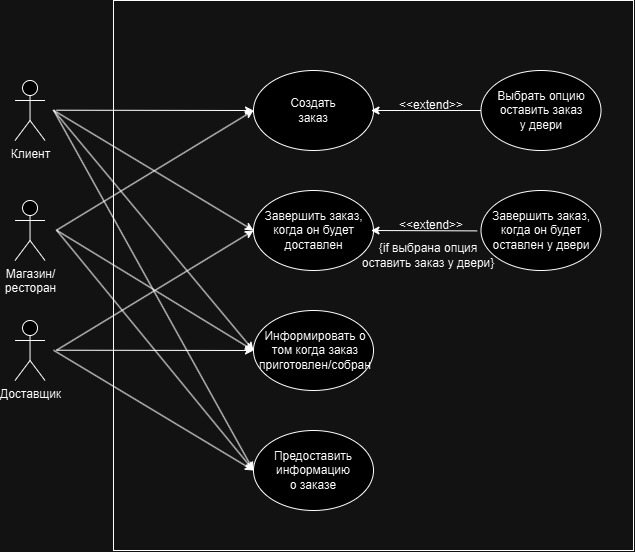

# Terms of Reference 3:  
  
**Клонирование репозитория:**
   
   ```bash
    git clone https://github.com/NeverovVictor/Programming-technologies-3.git
   ```
## Описание системы

Система показаная в работе основана на представлениях студента о том как должна работать система приложений по доставке еды. Сама система очень сильно упрощена из-за её сложности, сделано это для более лёгкого восприятия работы.

## Диаграмма вариантов использования



## Диаграмма последовательности для процесса


## Диаграмма состояний для заказа


## Диограмма деятельности


## Автор

Неверов Виктор (ВШЭ, бизнес-информатика, 1 курс, 232)
